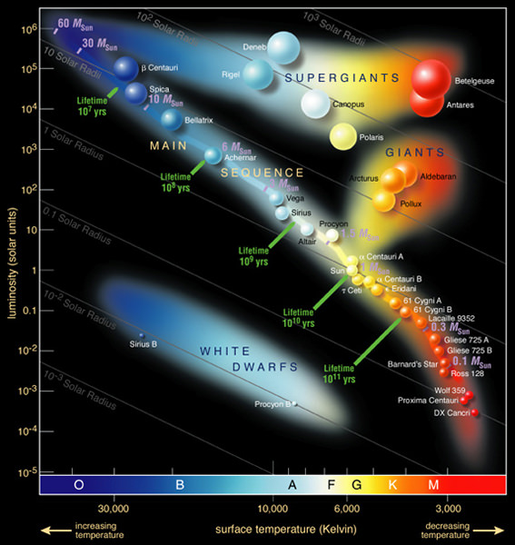
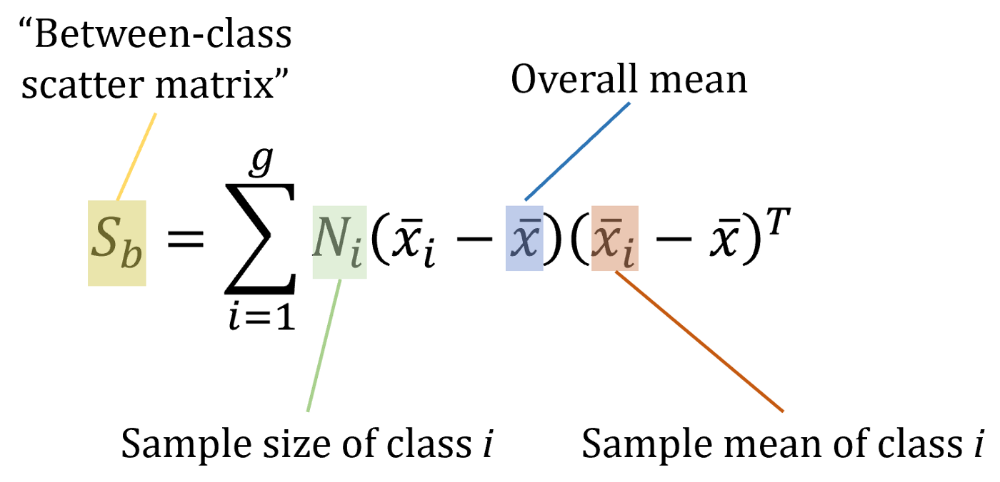
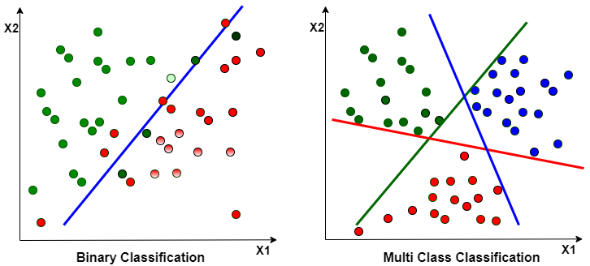
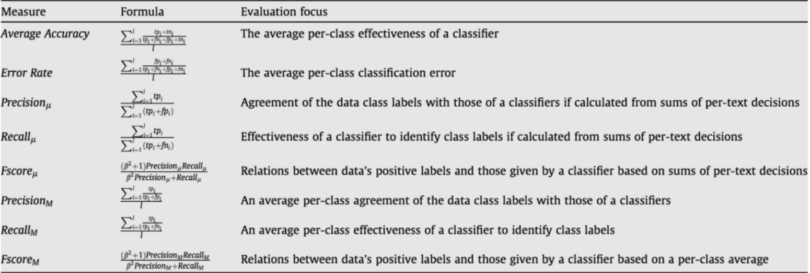

# Star classification
* **Introduction project**  : Data about star and we build model to predict type of start

## Data
* **Link of data :**  *https://www.kaggle.com/datasets/brsdincer/star-type-classification*

* **Attribute :**
  1. Temperature (K): Temperature of star
  2. L -- L/Lo: Solar luminosity *Lo = 3.828 x 10^26 Watts*
  3. R -- R/Ro: *Ro = 6.9551 x 10^8 m*
  4. AM -- Mv: Absolute magnitude
  5. Color -- General Color of Spectrum
  6. Spectral_Class -- O,B,A,F,G,K,M / SMASS: An asteroid spectral type is assigned to asteroids based on their emission spectrum, color, and sometimes albedo

| Class       | Albedo          |                                       Spectral Features                                        |
| :-----------: | :-----------: | :-----------------:                                                                                 |
| A           | moderate        | Very steep red slope shortward of 0.75 μm; moderately deep absorption feature longward of 0.75 μm.|
| B,F,G       | low             | Linear, generally featureless spectra. Differences in UV absorption features and presence/absence of narrow absorption feature near 0.7 μm.|
| K             |moderate | Moderately steep red slope shortward of 0.75 μm; smoothly angled maximum and flat to blueish longward of 0.75 μm, with little or no curvature.|
| M             |from low (P) to very high (E)         |Generally featureless spectrum with reddish slope; differences in subtle absorption features and/or spectral curvature and/or peak relative reflectance.|

* **Target**

    * Red Dwarf 
        
    
    * Brown Dwarf 
        
    
    * White Dwarf 
        
    
    * Main Sequence 
        
    
    * Super Giants 
        
    
    * Hyper Giants
        

## Processing data
**Using label encoding for category attribute:**

In machine learning, we usually deal with datasets that contain multiple labels in one or more than one columns. These labels can be in the form of words or numbers. To make the data understandable or in human-readable form, the training data is often labelled in words. 

Label Encoding refers to converting the labels into a numeric form so as to convert them into the machine-readable form. Machine learning algorithms can then decide in a better way how those labels must be operated. It is an important pre-processing step for the structured dataset in supervised learning.

*Example:*
|Color|Label encoding|
|:---:|:---:|
|Red  |0    |
|Blue |1    |
|Yellow|2   |
|Red|0      |

**Using LDA(Linear discriminant analysis) for reducing dimension of data:**

Linear Discriminant Analysis or Normal Discriminant Analysis or Discriminant Function Analysis is a dimensionality reduction technique that is commonly used for supervised classification problems. It is used for modelling differences in groups i.e. separating two or more classes. It is used to project the features in higher dimension space into a lower dimension space. 
For example, we have two classes and we need to separate them efficiently. Classes can have multiple features. Using only a single feature to classify them may result in some overlapping as shown in the below figure. So, we will keep on increasing the number of features for proper classification. 

## Train model

**Using Logistic Regression for multiclass classification**

Multinomial logistic regression is used to predict categorical placement in or the
probability of category membership on a dependent variable based on multiple independent
variables. The independent variables can be either dichotomous (i.e., binary) or continuous (i.e.,
interval or ratio in scale). Multinomial logistic regression is a simple extension of binary logistic
regression that allows for more than two categories of the dependent or outcome variable. Like
binary logistic regression, multinomial logistic regression uses maximum likelihood estimation
to evaluate the probability of categorical membership

## Evalute model

